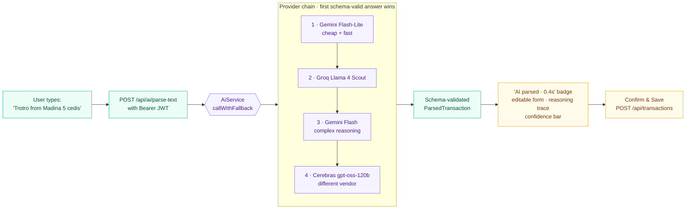

# TrackAm

**AI-powered financial intelligence for Africans the credit system forgot, from market traders to salaried professionals. The structured transaction history it generates is the missing foundation for fair African credit scoring.** Built for the BeOrchid Africa Developers Hackathon 2026 (FinTech track). Solo build by [Philip Narteh](https://github.com/Phinart98), Accra.

→ **Live app:** **https://trackam-indol.vercel.app**
→ **Backend repo:** [trackam-api](https://github.com/Phinart98/trackam-api) (Spring Boot + Spring AI on Cloud Run)
→ **Architecture:** [`docs/ARCHITECTURE.md`](docs/ARCHITECTURE.md)

---

## Why this matters

85.8% of African employment is informal¹, and Africa processed $1.1 trillion in mobile money in 2024². Most of that activity produces no financial record. The gap reaches beyond the informal economy too. Even formally employed Africans rarely use QuickBooks or Expensify, because those tools assume a financial culture with no MoMo, no mixed currencies, and no side hustle running alongside a salary. Without records, neither the market trader nor the salaried freelancer can prove their financial story to a bank. That missing paper trail is a big part of why credit scoring works so poorly across the continent.

TrackAm starts from where people actually are. Type a transaction in plain language, snap a receipt, or speak it out loud. Over time the app builds the structured, audit-trailed financial history that has always been missing in this region. It begins life as a tracker, and the data it accumulates becomes the foundation for credit that actually works in Africa.

## Try it (under 60 seconds)

1. Open **https://trackam-indol.vercel.app** in any browser.
2. Sign up with email + password (real Supabase auth, your data is yours).
3. On the Add Entry page, type something natural like:
   ```
   Bought 3 bags of rice 150 cedis at Makola
   ```
4. Hit **Parse with AI**. Watch the violet `AI parsed · 0.4s` badge appear, then click **How I parsed this** to see which tokens in your sentence drove which fields.
5. Hit **Confirm & Save** and the dashboard updates instantly. Now ask the advisor: *"Where do I spend the most?"*

> Cloud Run idles after a quiet period. If the first response feels slow, give it 10–15 seconds to warm up.

## If you only read one thing

- **A real, deployed MVP.** Nuxt 4 frontend on Vercel, Spring Boot 3.4 backend on Google Cloud Run, Supabase Postgres with pgvector. Both tiers are live and real data flows end to end.
- **A 4-provider AI fallback chain** for text parsing (Gemini Flash-Lite → Groq → Gemini Flash → Cerebras). Groq Llama 4 Scout handles vision for receipts and MoMo screenshots. The advisor stuffs an aggregated, server-scoped summary of your real transactions into the LLM prompt, so answers are grounded in your data without giving the model any way to request someone else's.
- **The "AI moment" is visible.** Every parse shows a badge with the parse latency and a collapsible reasoning trace highlighting the input tokens that drove each field. No black box.
- **41 backend tests** covering JWT validation, the AI fallback chain, prompt-injection guardrails, and the FX currency-match validator that prevents balance corruption.
- **Real-world adaptability.** Multi-currency support with conversion at the historical rate per transaction. MoMo and cash-first design. Voice input for users who would rather speak than type.

See [`docs/ARCHITECTURE.md`](docs/ARCHITECTURE.md) for the full diagram, reliability layer, security model, and end-to-end data flow.

## How it works (the "AI moment" flow)



The confidence bar shows red below 80, yellow from 80 to 89, and green at 90 and above. Every parsed field stays editable before saving, so the user always has the final word.

## Stack

- **Nuxt 4** · **Vue 3** · **Tailwind CSS 4** · **Nuxt UI 4**
- **Pinia** (state, persisted via `pinia-plugin-persistedstate`)
- **Chart.js + vue-chartjs** (income/expense, category doughnut, activity heatmap)
- **Supabase JS SDK** (auth, with the JWT validated server-side via JWKS)
- **PWA-ready** via `@vite-pwa/nuxt`

## Local setup

**Prerequisites:** Node.js 20+, pnpm 10+

1. Copy the env template and fill in your values:
   ```bash
   cp .env.example .env.local
   ```

2. Install and run:
   ```bash
   pnpm install
   pnpm dev
   ```

App runs at `http://localhost:3000` (or `3333` if 3000 is taken). The `dev` script loads `.env.local` automatically.

Requires the [trackam-api](https://github.com/Phinart98/trackam-api) backend (locally on port 8080, or pointed at the Cloud Run URL).

## Environment variables

| Variable | Description |
|----------|-------------|
| `NUXT_PUBLIC_API_BASE_URL` | Backend URL (`http://localhost:8080` for dev, Cloud Run URL for prod) |
| `NUXT_PUBLIC_SUPABASE_URL` | Supabase project URL |
| `NUXT_PUBLIC_SUPABASE_ANON_KEY` | Supabase anon/public key |

## Deployment

Deploys to Vercel. Push to `master` and it auto-deploys. Set the three env vars above in Project Settings, pointing `NUXT_PUBLIC_API_BASE_URL` at your Cloud Run backend URL.

Security headers (`X-Frame-Options`, `X-Content-Type-Options`, `Referrer-Policy`, `Permissions-Policy`) are applied via [`vercel.json`](vercel.json).

## Project structure

```
app/
├── pages/         # dashboard, add, history, advisor, goals, categories, more, login, onboarding
├── components/    # shared UI
├── stores/        # Pinia: auth, transactions, goals, categories, chat
├── composables/   # useAI, useSupabase, useAuthToken, useVoice, useConfirm
├── utils/         # formatters, forecasting, parseBreakdown (AI moment reasoning)
├── middleware/    # auth.global (route guards, gated on auth._initialized)
└── types/         # TypeScript interfaces
docs/
└── ARCHITECTURE.md  # full architecture + reliability layer + data flow
```

---

¹ ILO, *Women and Men in the Informal Economy*, 3rd ed. (2018). 85.8% of African employment is informal.
² GSMA, *State of the Industry Report on Mobile Money 2025*. Africa processed $1.105 trillion in mobile money in 2024.
