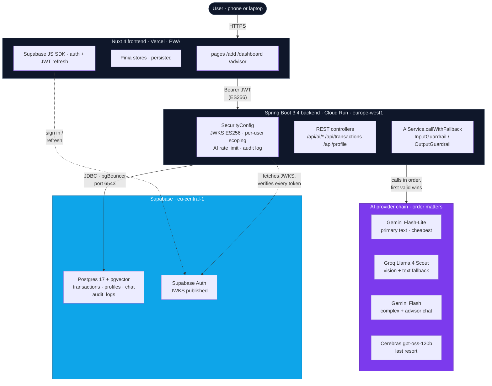

# TrackAm — Architecture

**AI-Powered Financial Intelligence for Africans the Credit System Forgot** · BeOrchid Africa Developers Hackathon 2026 (FinTech)

---

## The problem

**85.8% of African employment is informal**¹. Market traders, trotro drivers, food vendors, freelancers. They power the continent's economy, yet their transactions produce no financial record. Africa processed **$1.1 trillion in mobile money in 2024**², most of it untracked. Without records, workers can't track profitability, identify wasteful spending, access credit, or make data-driven decisions.

The gap isn't only informal, though. Even formally employed Africans (salaried professionals with side hustles, small business owners managing a salary plus a fabric shop, freelance designers with clients in three currencies) don't use QuickBooks or Expensify. Those tools were built for a financial culture that doesn't include MoMo, mixed currencies as a daily reality, family obligations as a recurring expense, or cash as the primary rail. A Kampala study³ found **68.6% of SMEs cite lack of accounting knowledge** as the primary barrier to record-keeping. The same friction stops salaried Africans the same way.

### The credit-scoring gap this opens

The downstream consequence is the deepest one. African credit infrastructure is broken because **most of the continent has no formal financial history**. Informal earners by definition, but also salaried earners whose MoMo flows, side hustles, and cash income never reach a bank ledger. Banks ask for records that don't exist. Users can't get loans, can't grow businesses, can't smooth income shocks.

TrackAm's design choice is deliberate. Every transaction is stored with full provenance: timestamp, source (manual, text, voice, image), confidence, original currency, AI audit log. Over months of use, a user passively accumulates the **structured, audit-trailed financial history** that credit scoring has always needed in this region. Today TrackAm is a tracker. The next layer is fair, locally-grounded credit scoring built on top.

TrackAm meets every African where they are. Cash, MoMo, handwritten receipts, natural language. No accounting knowledge required.

## What it does

| Surface | Example input | What the AI returns |
|---|---|---|
| **Natural language** | `"Bought 3 bags of rice 150 cedis at Makola"` | `{amount: 450, category: market, vendor: Makola, type: expense, confidence: 95}` |
| **MoMo screenshot** | upload MTN/Vodafone confirmation | parsed sender/receiver/amount/reference/date |
| **Receipt photo** | snap any printed/handwritten receipt | structured line items + total |
| **Voice** | speak the transaction | transcribed → then parsed as text |
| **Advisor chat** | `"Where do I spend the most?"` | Aggregated context built from YOUR real transactions, then grounded LLM answer |

The "AI moment" surfaces every parse visibly: a violet badge (`AI parsed · 0.4s`) and a `How I parsed this` panel showing which tokens in the original input drove each parsed field. This builds trust. Judges and users can see the AI isn't a black box.

## System diagram



> Renders as SVG on GitHub. Raw `.md` viewers see the labelled Mermaid source.

## AI provider strategy

A four-provider chain with deterministic ordering. The first provider returning a schema-valid response wins; on failure (network, rate-limit, schema-invalid), the next is tried.

| Provider | Role | Why this slot |
|---|---|---|
| **Groq — Llama 4 Scout** | Vision (receipts, MoMo screenshots) | Cheapest fast vision; 1,000 req/day free |
| **Google Gemini Flash-Lite** | Primary text parsing | Lowest latency + cost for simple natural-language parses |
| **Google Gemini Flash** | Complex text parses + advisor chat fallback | Stronger reasoning; second-tier model when the cheap one isn't sure |
| **Cerebras gpt-oss-120b** | Final text fallback | Different vendor entirely — survives Google outages |

Native API integrations (not OpenAI-compat shims). Embeddings use **Gemini `gemini-embedding-001` via the native API** because the OpenAI-compat dimensions parameter was unreliable.

## Reliability layer (the things production AI requires)

Most AI demos call an API and display the result. TrackAm builds a full reliability layer around every AI interaction:

| Pattern | What it does | Where |
|---|---|---|
| **Schema-validated structured output** | Every AI response must match a strict DTO. Invalid amounts, impossible dates, made-up categories rejected before save. | `dto/ParsedTransactionResponse.java`, `ai/TextParserPrompt.java` |
| **Confidence scoring + human-in-the-loop** | Every parse returns confidence 0–100; UI shows it; user confirms before saving. Below threshold, the UI nudges manual review. | `dto/ParsedTransactionResponse.java`, `app/pages/add.vue` |
| **Input guardrails** | Reject prompt injection, non-financial queries; magic-byte image validation; size limits. | `ai/guardrails/InputGuardrail.java` |
| **Output guardrails** | Clamp impossible amounts, reject future-dated transactions, sanitize hallucinated category IDs. | `ai/guardrails/OutputGuardrail.java` |
| **Multi-provider fallback** | `callWithFallback()` tries each provider in order, logs each attempt, throws `TrackAmException` only when all exhaust. | `service/AiService.java` |
| **Per-user sliding-window rate limit** | 60 AI requests / minute per `userId`, 429 with `Retry-After` header. | `config/SecurityConfig.AiRateLimitFilter` |
| **Audit trail** | Every AI call recorded async: user, operation, latency, success/fail. Survives crashes. | `service/AuditService.java` |
| **Server-controlled context scoping** | Advisor loads transactions from Postgres scoped by JWT subject before they ever reach the LLM. The model has no input field through which it could request a different user's data. | `service/AiService.askAdvisor` |

## Authentication

- Supabase issues a JWT (ES256, JWKS-published) on email+password sign-in.
- Frontend stores the session; attaches `Authorization: Bearer <jwt>` to every backend call.
- Backend validates via `NimbusJwtDecoder.withJwkSetUri(...)` + `JwtIssuerValidator` + `JwtClaimValidator` (audience `authenticated`). No shared secret.
- Every controller extracts `userId` from the validated JWT subject, then passes it to services and uses it to scope every query. **No cross-user data leak path possible.**
- Passwords stored as bcrypt `$2a$10$` (verified).

## Data flow — the "AI moment" parse

```
1. User types: "Bought kelewele from Madina market 15 cedis"
2. Frontend → POST /api/ai/parse-text { text, currency } + JWT
3. Backend SecurityConfig validates JWT → extracts userId
4. AiRateLimitFilter checks userId's sliding window (60/min)
5. AiController.parseText(request, jwt) → AiService.parseText(text, currency, userId)
6. InputGuardrail.validateText(text) — reject if prompt injection / non-financial
7. AiService.callWithFallback(userId, "parse-text", ...):
     a. Gemini Flash-Lite (primary) — structured output → ParsedTransactionResponse
     b. if a throws → Groq (vision-capable but also text-fallback)
     c. if b throws → Gemini Flash
     d. if c throws → Cerebras gpt-oss-120b
     e. all exhaust → TrackAmException → GlobalExceptionHandler → 503
8. OutputGuardrail.validate(result) — clamp amount, fix date, validate category
9. AuditService.logAsync(userId, "parse-text", latency, success)
10. Return ParsedTransactionResponse { amount, category, type, description, confidence, ... }
11. Frontend renders:
      · "AI parsed · 0.4s" violet badge
      · "How I parsed this" panel highlighting matched tokens in original input
      · confidence bar
12. User confirms → POST /api/transactions persists it
```

## Repos

- **Frontend:** [github.com/Phinart98/trackam](https://github.com/Phinart98/trackam) → deployed at https://trackam-indol.vercel.app
- **Backend:** [github.com/Phinart98/trackam-api](https://github.com/Phinart98/trackam-api) → deployed on Google Cloud Run (`europe-west1`)

## References

1. ILO, *Women and Men in the Informal Economy*, 3rd ed. (2018). [ilo.org](https://www.ilo.org/sites/default/files/wcmsp5/groups/public/@dgreports/@dcomm/documents/publication/wcms_626831.pdf)
2. GSMA, *State of the Industry Report on Mobile Money 2025*. [gsma.com/sotir](https://www.gsma.com/sotir/)
3. ResearchGate, *Financial Records Keeping And Performance of SME in Organizations* (Dec 2025), Kampala study of 156 SMEs. [researchgate.net](https://www.researchgate.net/publication/398985393)
