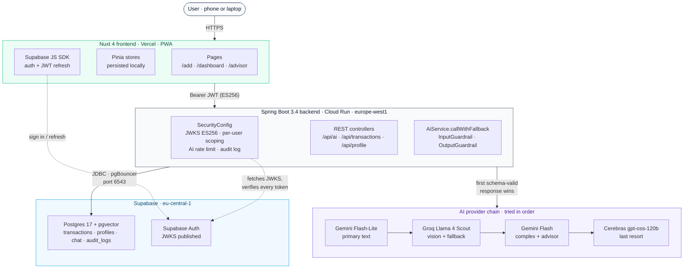
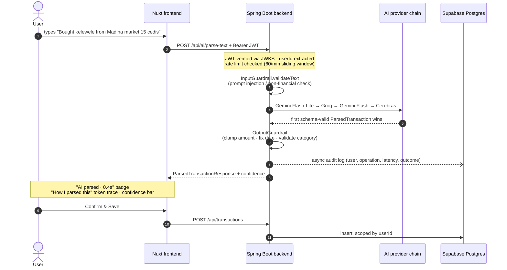

# TrackAm — Architecture

**AI-Powered Financial Intelligence for Africans the Credit System Forgot** · BeOrchid Africa Developers Hackathon 2026 (FinTech)

---

## The problem

**85.8% of African employment is informal**¹. Market traders, trotro drivers, food vendors, freelancers. They power the continent's economy, yet their transactions produce no financial record. Africa processed **$1.1 trillion in mobile money in 2024**², most of it untracked. Without records, workers can't track profitability, identify wasteful spending, access credit, or make data-driven decisions.

The gap reaches beyond the informal economy. Salaried professionals with side hustles, small business owners juggling a payslip and a fabric shop, freelance designers billing clients in three currencies. None of them use QuickBooks or Expensify either, because those tools assume a financial culture with no MoMo, no mixed currencies as a daily reality, no family obligations as a recurring expense, and no cash as the primary rail. A Kampala study³ found **68.6% of SMEs cite lack of accounting knowledge** as the primary barrier to record-keeping. The same friction stops salaried Africans the same way.

### The credit-scoring gap this opens

The downstream consequence cuts deepest. African credit infrastructure is broken because most of the continent has no formal financial history. That covers informal earners by definition, but also salaried earners whose MoMo flows, side hustles, and cash income never reach a bank ledger. Banks ask for records that don't exist, so users can't get loans, can't grow businesses, and can't smooth income shocks.

TrackAm stores every transaction with full provenance: timestamp, source (manual, text, voice, image), confidence, original currency, AI audit log. That design choice is deliberate. Over months of use, a user passively accumulates the **structured, audit-trailed financial history** that credit scoring has always needed in this region. Today TrackAm is a tracker. The next layer is fair, locally grounded credit scoring built on top of it.

TrackAm meets every African where they are. Cash, MoMo, handwritten receipts, natural language. No accounting knowledge required.

## What it does

| Surface | Example input | What the AI returns |
|---|---|---|
| **Natural language** | `"Bought 3 bags of rice 150 cedis at Makola"` | `{amount: 450, category: market, vendor: Makola, type: expense, confidence: 95}` |
| **MoMo screenshot** | upload MTN/Vodafone confirmation | parsed sender/receiver/amount/reference/date |
| **Receipt photo** | snap any printed/handwritten receipt | structured line items + total |
| **Voice** | speak the transaction | transcribed, then parsed as text |
| **Advisor chat** | `"Where do I spend the most?"` | Aggregated context built from YOUR real transactions, then a grounded LLM answer |

Every parse is surfaced visibly as an "AI moment": a violet badge (`AI parsed · 0.4s`) and a `How I parsed this` panel showing which tokens in the original input drove each parsed field. This builds trust. Judges and users can see the AI is not a black box.

## System diagram

> The diagram renders as SVG on GitHub. Raw markdown viewers see the labelled Mermaid source instead.

## AI provider strategy

A four-provider chain with deterministic ordering. The first provider returning a schema-valid response wins. On failure (network, rate limit, schema-invalid), the next is tried.

| Provider | Role | Why this slot |
|---|---|---|
| **Google Gemini Flash-Lite** | Primary text parsing | Lowest latency and cost for simple natural-language parses |
| **Groq — Llama 4 Scout** | Vision (receipts, MoMo screenshots) + text fallback | Cheapest fast vision; 1,000 req/day free |
| **Google Gemini Flash** | Complex text parses + advisor chat fallback | Stronger reasoning when the cheap model isn't sure |
| **Cerebras gpt-oss-120b** | Final text fallback | A different vendor entirely, so it survives Google outages |

All four are native API integrations rather than OpenAI-compat shims. Embeddings use **Gemini `gemini-embedding-001` via the native API** because the OpenAI-compat dimensions parameter was unreliable.

## Reliability layer (the things production AI requires)

Most AI demos call an API and display the result. TrackAm builds a full reliability layer around every AI interaction:

| Pattern | What it does | Where |
|---|---|---|
| **Schema-validated structured output** | Every AI response must match a strict DTO. Invalid amounts, impossible dates, and made-up categories are rejected before save. | `dto/ParsedTransactionResponse.java`, `ai/TextParserPrompt.java` |
| **Confidence scoring + human-in-the-loop** | Every parse returns confidence 0–100. The UI shows it, and the user confirms before saving. Below threshold, the UI nudges manual review. | `dto/ParsedTransactionResponse.java`, `app/pages/add.vue` |
| **Input guardrails** | Reject prompt injection and non-financial queries. Magic-byte image validation. Size limits. | `ai/guardrails/InputGuardrail.java` |
| **Output guardrails** | Clamp impossible amounts, reject future-dated transactions, sanitize hallucinated category IDs. | `ai/guardrails/OutputGuardrail.java` |
| **Multi-provider fallback** | `callWithFallback()` tries each provider in order, logs each attempt, and throws `TrackAmException` only when all are exhausted. | `service/AiService.java` |
| **Per-user sliding-window rate limit** | 60 AI requests per minute per `userId`, returning 429 with a `Retry-After` header. | `config/SecurityConfig.AiRateLimitFilter` |
| **Audit trail** | Every AI call recorded async: user, operation, latency, success/fail. Survives crashes. | `service/AuditService.java` |
| **Server-controlled context scoping** | The advisor loads transactions from Postgres scoped by the JWT subject before they ever reach the LLM. The model has no input field through which it could request a different user's data. | `service/AiService.askAdvisor` |

## Authentication

- Supabase issues a JWT (ES256, JWKS-published) on email+password sign-in.
- The frontend stores the session and attaches `Authorization: Bearer <jwt>` to every backend call.
- The backend validates via `NimbusJwtDecoder.withJwkSetUri(...)` plus `JwtIssuerValidator` and `JwtClaimValidator` (audience `authenticated`). No shared secret.
- Every controller extracts `userId` from the validated JWT subject, passes it to services, and uses it to scope every query. **No cross-user data leak path possible.**
- Passwords are stored as bcrypt `$2a$10$` (verified).

## Data flow — the "AI moment" parse

If every provider in the chain fails, the backend throws `TrackAmException`, which `GlobalExceptionHandler` turns into a clean 503 for the client. The frontend shows an inline banner plus a toast and keeps the user's input intact for a retry.

## Repos

- **Frontend:** [github.com/Phinart98/trackam](https://github.com/Phinart98/trackam) → deployed at https://trackam-indol.vercel.app
- **Backend:** [github.com/Phinart98/trackam-api](https://github.com/Phinart98/trackam-api) → deployed on Google Cloud Run (`europe-west1`)

## References

1. ILO, *Women and Men in the Informal Economy*, 3rd ed. (2018). [ilo.org](https://www.ilo.org/sites/default/files/wcmsp5/groups/public/@dgreports/@dcomm/documents/publication/wcms_626831.pdf)
2. GSMA, *State of the Industry Report on Mobile Money 2025*. [gsma.com/sotir](https://www.gsma.com/sotir/)
3. ResearchGate, *Financial Records Keeping And Performance of SME in Organizations* (Dec 2025), Kampala study of 156 SMEs. [researchgate.net](https://www.researchgate.net/publication/398985393)
